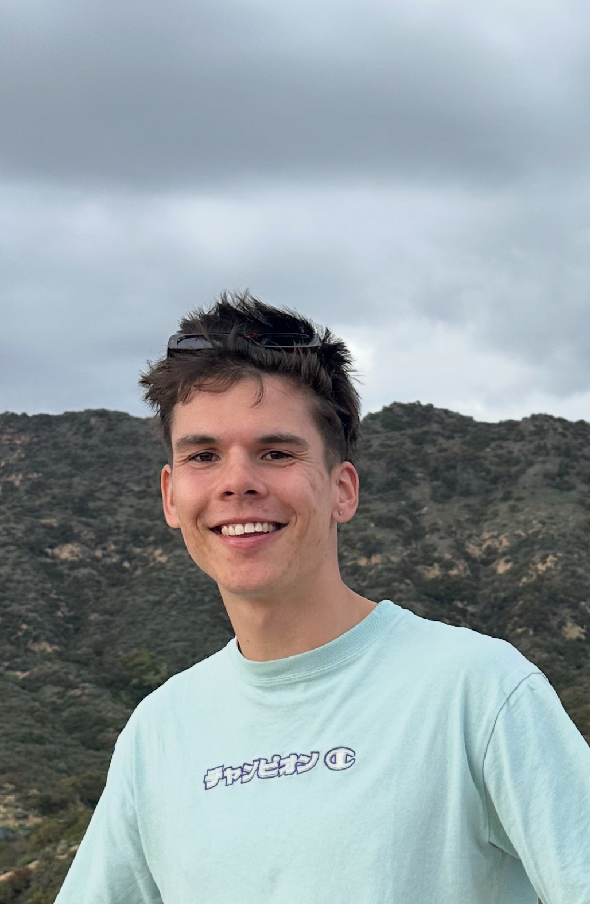

# Welcome to My User Page! 👋

### Section Links

You can navigate to different sections of this page using the links below:

*   [About Me](#about-me)
*   [My Skills](#my-skills)
*   [How I see life](#how-i-see-life)
*   [My Hobbies](#my-hobbies)

## About Me

Hello! My name is **Fabio**. I'm a **dual student** at Bechtle, currently completing my **Abroad Semester** at the **University of California in San Diego (UCSD)**. I am pursuing a major in **Information Systems** with a specialization in **Software Engineering**.

Aside from my studies, I am someone who loves sports and being outdoors. Whether it's skiing in the mountains or spending time by the sea, I always enjoy being active. I also love riding my skateboard in my free time.

I would describe myself as an open and curious person, always willing to try new things and learn from new experiences.

## My Skills

Here are some of the skills and technologies I am currently working with:

- **Programming Languages**:
  - Python
  - JavaScript
  - Java
  - Scala

- **Web Development**:
  - HTML, CSS
  - Node.js

- **Software Engineering**:
  - Object-Oriented Programming (OOP)
  - Functional Programming
  - Agile and Scrum methodologies

### Code Example

```python
def greet(name):
    print(f"Hello, {name}! Welcome to my User Page.")

greet("Fabio")
```

## Picture of Me

Here is a picture of me taken during my time abroad in San Diego:



## How I see life

> "Life is either a daring adventure or nothing at all." – Helen Keller

This quote perfectly reflects how I approach life. I always look for new challenges and experiences to grow as a person.

## Links

*   [Check out my GitHub profile](https://github.com/ruhlando) 
*   [My ReadMe](README.md)
*   [Explore UCSD](https://www.ucsd.edu/)
*   [Read about Bechtle](https://www.bechtle.com/)

## My Hobbies

Here are some of my hobbies and interests:

1.  **Skiing** 🏔️
2.  **Skateboarding** 🛹
3.  **Beach activities** 🏖️
4.  **Exploring new places** 🌍

## Things I want to do

*   [ ] Abroad Semester in San Diego
*   [ ] Learn more about Machine Learning
*   [ ] Start a new personal coding project
*   [ ] Learn how to surf